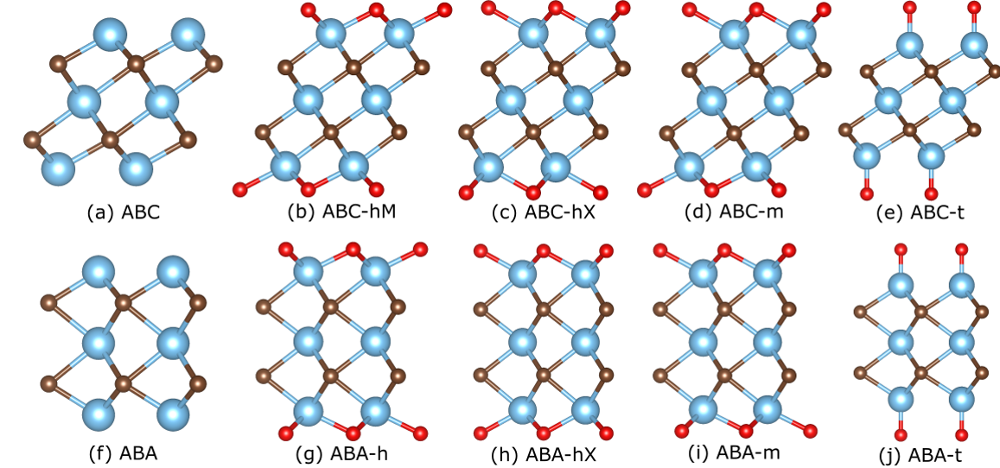

# Read Me

Why do we need ML/DL methods? MXenes have possibly largest 2D chemical space [1]. MXene synthesis remains costly and time-consuming [2]. Density Functional Theory (DFT): accurate but too slow for high-throughput predictions [3]. ML/DL models are great for making very large numbers of predictions quickly.

Our contributions:
* A pipeline to perform high-throughput MXene property predictions with greater accuracy and computationally cheaper inputs than current ML methods
* Takes ~1 second to calculate a target property for one MXene
	- **~50,000x faster than DFT**
* We predict MXene target properties for 13 million unique MXenes.
  	- **To our knowledge, this is the largest publicly-available dataset of MXenes properties to date.**

The MXenes with the most extreme predictions (largest 1,000 and smallest 1,000) across our 13 million MXenes for each of the 9 target properties predicted can be found in the file: extrema_results.csv

We only provide this small subset of our predictions because the entire prediction dataset containing 13 million MXenes is over 1 GB, much too large for GitHub. Please send me an email at ewvertina@wpi.edu if you would like access to the entire prediction dataset and/or the entire set of 13 million generated .cif files, and I would be happy to share the data (though we would have to figure out the best way to share this data).

* [1] J. Park et al. Active learning framework for expediting the search of thermodynamically stable MXenes in the extensive chemical space. ACS Nano, 18(43):29678–29688, 2024. PMID: 39401454.
* [2] B. Anasori and Y. Gogotsi. 2D Metal Carbides and Nitrides (MXenes) Structure, Properties and Applications. Springer, 06 2019.
* [3] H. Bing, O. A. von Lillenfeld, and D. Bakowies. personal communication. 2017.

# Desired MXene target properties

|Property Name|Property Name (continued)|
|----------|----------|
|Band Gap|Magnetic (T/F)|
|Carrier Density|Metallic (T/F)|
|Carrier Effective Mass|Optical Absorption Coefficient|
|Carrier Lifetime|Permeability|
|Carrier Mobility|Permittivity|
|Charge Recombination|Poisson’s Ratio|
|d-Band Center|Reflectivity|
|Density of States at Fermi Level|Resistivity|
|Dynamically Stable|Seebeck Coefficient |
|Elastic Moduli (Bulk, Shear, Young’s)|Sensitivity to Disorder|
|Elastic Coefficients, c11 and c12|(Termination) Binding Energy|
|Energy above Convex Hull|Thermal Conductivity|
|Electrical Conductivity|THz Range (Transmission)|
|Heat of Formation|Transmittance|
|Hole Effective Mass|Work Function|
|Lattice Constant||

# MXene elements, structure types considered
MXene M elements we consider

MXene X elements we consider

MXene Tx (surface terminations) we consider

MXene structure types we consider:

# Our workflow

	<>

Our training data comes from the Computational 2D Materials Database [4,5] (found here: https://2dhub.org/c2db/c2db.html )  and from [6] (found here: https://github.com/Deskins-group/Structure-Files/tree/master/MXene-structure-properties )

* [4] S. Haastrup et al. The Computational 2D Materials Database: high-throughput modeling and discovery of atomically thin crystals. 2D Materials, 5(4), 09 2018. https://2dhub.org/c2db/c2db.html
* [5] M. N. Gjerding et al. Recent progress of the Computational 2D Materials Database (C2DB). 2D Materials, 8(4), 09 2021. https://2dhub.org/c2db/c2db.html
* [6] Emily Sutherland, Benjamin Traverso, and N. Aaron Deskins. Impact of composition on the structural, electronic, and mechanical properties of M3C2T2 MXenes. Mater. Adv. 2025. DOI: 10.1039/D5MA00874C. RSC. https://github.com/Deskins-group/Structure-Files/tree/master/MXene-structure-properties

# Prediction results for 13 million MXenes
The following are violin plots for each of the 9 target properties that we predicted across all 13 million+ unique MXenes that we generated.

# Using this code

This code is based on ALIGNN and ALIGNNTL models (Atomistic Line Graph Neural Network and Atomistic Line Graph Neural Network based Transfer Learning). See this link for the ALIGNNTL GitHub repository https://github.com/NU-CUCIS/ALIGNNTL.git   , and see these links for the ALIGNNTL and ALIGNN papers, respectively: 
https://www.nature.com/articles/s41524-023-01185-3    and     https://www.nature.com/articles/s41524-021-00650-1

Vishu Gupta et al. Structure-aware graph neural network based deep transfer learning framework for enhanced predictive analytics on diverse materials datasets. npj Computational Materials, 10(1):1, 2024.
Kamal Choudhary and Brian DeCost. Atomistic line graph neural network for improved materials property predictions. npj Computational Materials, 7(1), November 2021.

Create conda environment to run this code:
conda create --name env_name python=3.8
source activate env_name

Might need to install (the appropriate versions to get matching CUDA versions):
conda install dgl=2.1.0 pytorch torchvision torchaudio pytorch-cuda -c pytorch -c nvidia

conda install dgl=0.6.0 pytorch=1.7.1 torchvision=0.10.1 torchaudio=0.10.0 pytorch-cuda=10.1 -c pytorch -c nvidia
	(Check which versions to install and put them after each = sign, respectively)

Packages installed:
pip install numpy==1.19.5

pip install torch==1.8.0
	num-py
pip install scipy==1.6.1

pip install dgl-cu101==0.6.1
	sci-py
pip install dgl==0.6.1

pip install matplotlib=3.4.2

pip install tqdm==4.60.0

pip install pyparsing==2.2.1

pip install jarvis-tools==2021.07.19
	matplotlib
	tqdm
	pyparsing
pip install pytorch-ignite==0.4.7

pip install pydantic==1.8.1

pip install pycodestyle==2.7.0

pip install flake8==3.9.1
	pycodestyle
pip install pydocstyle==6.0.0

conda install pandas=1.2.3
	num-py

conda install matplotlib=3.4.2

conda install scikit-learn=0.23

conda install pandas=1.2.3

conda install matplotlib=3.4.2

conda install scikit-learn=0.23

pip install --force-reinstall charset-normalizer==2.0.4

Ran this in ALIGNNTL:
python -m pip install -e .
	might not have worked

Ran this in ALIGNNTL/FineTuning:
python -m pip install -e .
	Note: I copied the original setup.py file from .. into FineTuning

Steps for using ALIGNNTL such that I specify a source dataset that is similar to (probably has to have same target property) as a specified MXene property I want to predict:
	
 1. If not super large dataset, copy POSCAR/CIF/etc. files into a directory for the source dataset here:
		/path/ALIGNNTL/SOURCE_DIRECTORY
	
 2. Copy the .csv target properties for the dataset into the source dataset directory such that there are two columns, the first one being the name of the POSCAR/CIF/etc. file for the corresponding record, and the second being the value of the target property
	
 3. Copy the default config file into this source dataset directory
	
 4. Modify the config file to make sure that train n, val n, and test n are correct. 
	
 5. Change source_model to be the pretrained model for the specific property. If there isn't one, change this to "null" (if it isn't already null)
		a. Can even change "target"? If you know it??? Not sure about this, though
	
 6. Make sure that the batch size is a multiple of the training, test, val sets (or, at the very least, that it is smaller than these sets)
	
 7. Make sure that the number of epochs is small enough to do a quick run to see if it works (e.g. 3)
	
 8. Run this code, making sure that the correct root_dir, config file, id_prop_file, and output directory are correctly specified
	
 9. In VS code, open the ALIGNNTL directory in the explorer taskbar to the left
	10. Download the output directory from this source training task onto my laptop
		a. Perhaps then delete .pt files until there is only one .pt file remaining?
	
 11. Open the file directory on my laptop, go to this downloaded directory, and zip this folder
	
 12. Move this .zip folder onto Turing by dragging its icon from the file directory onto VS code and place it into this directory:
		/path/ALIGNNTL/FineTuning/alignn/DIRECTORY_NAME.zip
	
 13. For my target MXenes dataset, change the config file's source model to have "DIRECTORY_NAME" as "source_model"
	
 14. Make sure that n_val, n_test, and n_train are correctly set
	
 15. Make sure that the batch size is smaller than the training, test, and val sets
	
 16. Make the number of epochs small just to make sure that this runs properly
	
 17. Edit the train.py file here to add the pretrained model that we just trained to the list of pretrained models. This file can be found here: /path/ALIGNNTL/FineTuning/alignn/train.py   . Code look something like this (if DIRECTORY_NAME is "2024-07-20"):
	
 BEFORE:
	all_models = {
	    "mp_e_form_alignnn": [
	        "https://figshare.com/ndownloader/files/31458811",
	        1,
	    ],
	    "mp_gappbe_alignnn": [
	        "https://figshare.com/ndownloader/files/31458814",
	        1,
	    ],
	    "jv_bulk_modulus_kv_alignn": [
	        "https://figshare.com/ndownloader/files/31458649",
	        1,
	    ],
	    }

AFTER:
all_models = {
    "mp_e_form_alignnn": [
        "https://figshare.com/ndownloader/files/31458811",
        1,
    ],
    "mp_gappbe_alignnn": [
        "https://figshare.com/ndownloader/files/31458814",
        1,
    ],
    "jv_bulk_modulus_kv_alignn": [
        "https://figshare.com/ndownloader/files/31458649",
        1,
    ],
    "2024-07-20": [
        "",
        1,
    ],
}
	

18. Run this code, making sure that the correct root_dir, config file, id_prop_file, and output directory are correctly specified. Predictions done!!

# My Works

PhD Dissertation: (link to dissertation coming soon!)

Papers:

1. Eric Warnemunde Vertina, Emily Sutherland, Sajal Chakroborty, N. Aaron Deskins, and Oren Mangoubi. Machine-Learning-Enabled High-Throughput MXene Property Prediction. IEEE NAP 2025. (Accepted for publication).

2. Eric Warnemunde Vertina, Sajal Chakroborty, Emily Sutherland, N. Aaron Deskins, and Oren Mangoubi. MXene Material Property Prediction via Transfer Learning
with Graph Neural Networks. IEEE ICAD 2025. https://ieeexplore.ieee.org/document/11114063

3. Eric Warnemunde Vertina, Emily Sutherland, N. Aaron Deskins, and Oren Mangoubi. “MXene Property Prediction via Graph Contrastive Learning.” IEEE NAP 2024. https://ieeexplore.ieee.org/abstract/document/10739742

4. Eric Warnemunde Vertina, Emily Sutherland, N. Aaron Deskins, and Oren Mangoubi. “Predicting MXene Properties via Machine Learning.” In Proceedings of the 2022 International Conference on Machine Learning and Applications (ICMLA). https://ieeexplore.ieee.org/abstract/document/10069589

