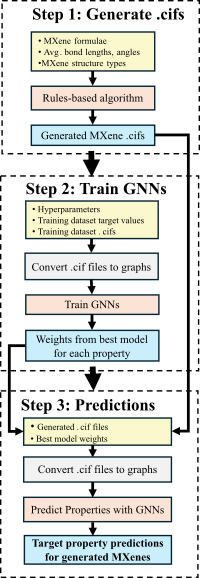

Read Me

Desired MXene target properties

MXene M elements we consider

MXene X elements we consider

MXene Tx (surface terminations) we consider

Our workflow

The following are violin plots for each of the 9 target properties that we predicted across all 13 million+ unique MXenes that we generated.

